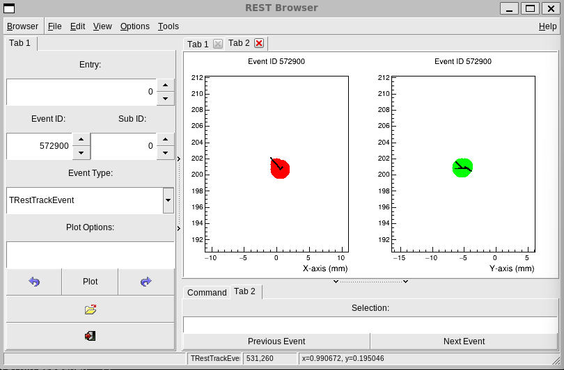

# Drawing Event Data
{: .no_toc }

### Table of contents
{: .no_toc .text-delta }

1. TOC
{:toc}

---

This page shows quick ways to draw REST event data. The examples use REST
objects and REST macros first, because that is usually the most convenient way
to inspect event content interactively.

If you are not sure which event type your file contains, see
[Data format](/rest-basics/rest-data-format.html).

## Open a File with restRoot

Start an interactive REST session by passing the file name to `restRoot`:

```bash
restRoot myFile.root
```

When the file is a valid REST run file, `restRoot` loads it through the
`REST_OpenInputFile.C` macro and creates a few useful objects in the ROOT
session:

- `run`: the [`TRestRun`](https://rest-for-physics.github.io/framework/classTRestRun.html)
  object.
- `ana_tree`: the
  [`TRestAnalysisTree`](https://rest-for-physics.github.io/framework/classTRestAnalysisTree.html).
- `ev_tree`: the ROOT event tree.
- `ev`: the input event object for the current entry.

The event type can be checked directly:

```cpp
ev->ClassName()
```

Load a different entry with:

```cpp
run->GetEntry(10);
ev->PrintEvent();
```

## Draw the Current Event

Most REST event classes implement `DrawEvent()`. After opening a file with
`restRoot`, draw the current entry with:

```cpp
ev->DrawEvent();
```

Then move to another entry and draw it:

```cpp
run->GetEntry(25);
ev->DrawEvent();
```

For a raw signal file, `ev` may be a
[`TRestRawSignalEvent`](https://rest-for-physics.github.io/framework/classTRestRawSignalEvent.html).
For detector-level files, it may instead be a
[`TRestDetectorSignalEvent`](https://rest-for-physics.github.io/framework/classTRestDetectorSignalEvent.html),
[`TRestDetectorHitsEvent`](https://rest-for-physics.github.io/framework/classTRestDetectorHitsEvent.html),
or [`TRestTrackEvent`](https://rest-for-physics.github.io/framework/classTRestTrackEvent.html).

If you want the typed pointer explicitly:

```cpp
auto rawEvent = run->GetInputEvent<TRestRawSignalEvent>();
rawEvent->DrawEvent();
```

or, for detector signals:

```cpp
auto signalEvent = run->GetInputEvent<TRestDetectorSignalEvent>();
signalEvent->DrawEvent();
```

## Draw with Event Options

Some event classes accept drawing options. For example, raw signal events
support options to draw selected channels or only signals passing a threshold
condition:

```cpp
ev->DrawEvent("ids[800,900]:printIDs");
```

```cpp
ev->DrawEvent("signalRangeID[800,900]:onlyGoodSignals[3.5,1.5,7]:baseLineRange[20,150]");
```

The available options depend on the event class. Check the corresponding class
reference when a specific drawing option is needed:

- [`TRestRawSignalEvent`](https://rest-for-physics.github.io/framework/classTRestRawSignalEvent.html)
- [`TRestDetectorSignalEvent`](https://rest-for-physics.github.io/framework/classTRestDetectorSignalEvent.html)
- [`TRestDetectorHitsEvent`](https://rest-for-physics.github.io/framework/classTRestDetectorHitsEvent.html)
- [`TRestTrackEvent`](https://rest-for-physics.github.io/framework/classTRestTrackEvent.html)

## Use the REST Event Viewer

For interactive browsing, use the REST event viewer instead of drawing one
event manually. From the shell:

```bash
restViewEvents myFile.root
```

or from a `restRoot` session:

```cpp
REST_ViewEvents("myFile.root");
```

This opens a `TRestBrowser` window with an event display and controls to move
between entries.



The screenshot shows a `TRestTrackEvent`. The event type selector in the left
panel can be used to switch between the event types available in the file, when
more than one representation was stored. The entry and event ID controls can be
used to move to a different event.

When an event is loaded, REST also prints information in the terminal. This
includes the event ID and the analysis observables available for that entry,
with their values. This is useful when checking that the event display and the
observables in the analysis tree refer to the same event.

The viewer uses the event type stored in the file by default. If needed, the
event type can also be specified explicitly:

```cpp
REST_ViewEvents("myFile.root", "TRestDetectorSignalEvent");
```

There is also a convenience macro for detector signal events:

```cpp
REST_ViewSignalEvent("myFile.root");
```

## Draw Analysis Observables

Event displays show the event object itself. For scalar or vector observables,
use the analysis tree:

```cpp
ana_tree->Draw("energy");
```

With a selection:

```cpp
ana_tree->Draw("energy", "nHits > 3");
```

Or draw one observable against another:

```cpp
ana_tree->Draw("yMean:xMean", "", "colz");
```

This is normal ROOT drawing applied to the REST analysis tree. It is useful for
quick checks, but it is different from drawing the event object with
`DrawEvent()`.

## Common Problems

If `ev` is null, the file may be an analysis-only file without stored event
objects. In that case, the analysis tree may still be available through
`ana_tree`, but event displays will not work.

If the graphics window does not open, make sure the session has graphical
display support. On a remote machine, this may require X11 forwarding or another
configured display.

If `restViewEvents` is not found, open the file with `restRoot` and call the
macro from the prompt:

```cpp
REST_ViewEvents("myFile.root");
```
