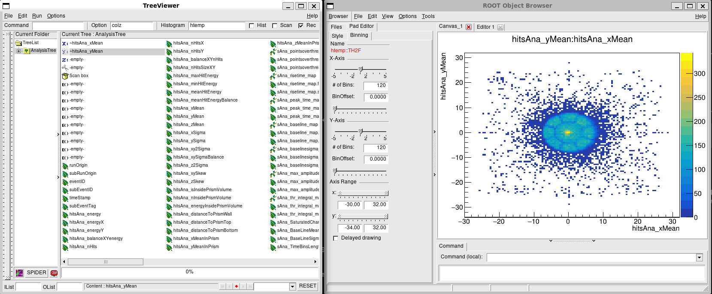

## Using restRoot to load REST file contents into an interactive ROOT-shell
{: .no_toc }

### Table of contents
{: .no_toc .text-delta }

1. TOC
{:toc}

---

`restRoot` is the standard interactive shell for inspecting REST files. It starts a ROOT session with the REST libraries loaded and, when a REST file is given as an argument, it opens the file using the REST macro `REST_OpenInputFile.C`.

```bash
restRoot myFile.root
```

For a REST run file, the macro creates a few objects directly in the interactive session. This is usually the quickest way to understand what is stored in a file before writing a longer macro or analysis script.

## Objects created by restRoot

When the input file contains a `TRestRun`, `restRoot` creates the following objects:

| Object | Type | Purpose |
|:--|:--|:--|
| `run` | [`TRestRun`](https://rest-for-physics.github.io/framework/classTRestRun.html) | Main run object. It gives access to metadata, entries, event objects, and file-level information. |
| `ana_tree` | [`TRestAnalysisTree`](https://rest-for-physics.github.io/framework/classTRestAnalysisTree.html) | Tree containing the analysis observables produced by REST processes. |
| `ev_tree` | `TTree` | ROOT tree containing the serialized event branch. |
| `ev` | input event class | Pointer to the current REST event, for example a `TRestRawSignalEvent`, `TRestDetectorSignalEvent`, `TRestDetectorHitsEvent`, or `TRestTrackEvent`. |

The input event type depends on the processing stage stored in the file. For example, a raw data file may contain a `TRestRawSignalEvent`, while a later reconstruction file may contain a `TRestTrackEvent`.

`restRoot` also prints the metadata objects found in the file. When possible, it creates variables for those metadata objects using their metadata names, so they can be inspected interactively from the ROOT prompt.

## First checks

Once the file is open, start by checking the number of entries and the event type:

```cpp
run->GetEntries();
run->GetInputEventName();
ev->ClassName();
```

To print a summary of the run and the current event:

```cpp
run->PrintMetadata();
ev->PrintEvent();
```

If the file contains an analysis tree, print the available observables:

```cpp
ana_tree->PrintObservables();
```

The observables are the quantities produced by REST processes during the data processing chain. They are stored separately from the event object, which contains the event data itself.

## Moving Through Entries

Use `TRestRun` to load a different entry:

```cpp
run->GetEntry(0);
ev->PrintEvent();

run->GetEntry(10);
ev->PrintEvent();
```

After calling `GetEntry`, the `ev` pointer is updated to the selected event. This makes it possible to inspect, draw, or print different events without reopening the file.

If you know the REST event ID instead of the tree entry number, you can ask `TRestRun` to find it:

```cpp
run->GetEventWithID(7);
ev->PrintEvent();
```

Entry numbers and event IDs are not always the same. Entry numbers are the positions inside the file, while event IDs are identifiers stored in the event metadata.

## Inspecting Metadata

Metadata objects describe how the file was produced: run information, detector setup, gas properties, electronics configuration, process configuration, and other contextual information depending on the application.

To list and inspect the metadata stored in the file:

```cpp
run->GetMetadataNames();
run->PrintMetadata();
```

To retrieve one metadata object by name:

```cpp
auto md = run->GetMetadata("metadataName");
md->PrintMetadata();
```

Replace `"metadataName"` with one of the names printed by `GetMetadataNames()` or by the file-opening summary.

## Inspecting Observables

The analysis tree can be inspected with the usual ROOT drawing commands, but through the object already opened by REST:

```cpp
ana_tree->PrintObservables();
ana_tree->Draw("observableName");
```

For example, after identifying an observable name with `PrintObservables()`, it can be plotted directly:

```cpp
ana_tree->Draw("tckAna_MaxTrackEnergy");
```

Several observables can also be combined in the usual ROOT syntax:

```cpp
ana_tree->Draw("tckAna_MaxTrackEnergy:tckAna_TotalTrackLength");
```

The exact observable names depend on the processes that were used to produce the file.

## Using The ROOT Browser

Because `restRoot` is a ROOT session with REST loaded, the standard ROOT `TBrowser` can also be used:

```cpp
new TBrowser;
```

This is often the most convenient way to explore the contents of a REST file interactively. For example, it can be used to open the analysis tree, browse the observable branches, draw observable distributions, or make two-dimensional plots by selecting different observables for the axes.



ROOT `TBrowser` and `TreeViewer` opened from a `restRoot` session. The example shows a Micromegas calibration hitmap produced by drawing `hitsAna_yMean:hitsAna_xMean` from the REST analysis tree using the `colz` option.

The usual ROOT drawing options are available from the browser or from the prompt. For example:

```cpp
ana_tree->Draw("tckAna_MaxTrackEnergy");
ana_tree->Draw("tckAna_MaxTrackEnergy:tckAna_TotalTrackLength");
ana_tree->Draw("tckAna_MaxTrackEnergy:tckAna_TotalTrackLength", "", "colz");
```

This is especially useful when the goal is to quickly check which observables are present, compare their distributions, or identify reasonable cuts before writing a dedicated analysis macro.

## Drawing And Browsing Events

The current event can be drawn from the interactive prompt:

```cpp
ev->DrawEvent();
```

For signal-like event types, drawing options may be passed to `DrawEvent`. For example:

```cpp
ev->DrawEvent("ids[800,900]:printIDs");
```

For interactive browsing, use the REST event viewer from the same `restRoot` session:

```cpp
REST_ViewEvents("myFile.root");
```

If the file contains several event types, one of them can be requested explicitly:

```cpp
REST_ViewEvents("myFile.root", "TRestDetectorSignalEvent");
```

More detailed examples are given in the pages about [drawing event data](https://rest-for-physics.github.io/getting-started/drawing-events.html) and [browsing and viewing events](https://rest-for-physics.github.io/getting-started/browsing-and-viewing-events.html).

## Dataset Files

If the input file contains a [`TRestDataSet`](https://rest-for-physics.github.io/framework/classTRestDataSet.html) instead of a `TRestRun`, `restRoot` creates a `dSet` object:

```cpp
restRoot myDataset.root
```

Inside the session:

```cpp
dSet->PrintMetadata();
dSet->GetDataFrame().GetColumnNames();
```

Dataset files are usually used for tabular analysis results rather than event-by-event inspection, so they do not provide the same `ev` event pointer created for run files.

## Common Problems

If `ev` is not created, the file may not contain a REST event tree, or it may be an analysis-only file.

If an event class cannot be loaded, check that the REST installation used to start `restRoot` includes the corresponding library. For example, files containing detector events require the detector library to be available.

If drawing commands do not open a canvas, check that the session has graphical display support. On a remote session, use X forwarding, VNC, or run the non-graphical inspection commands instead.
