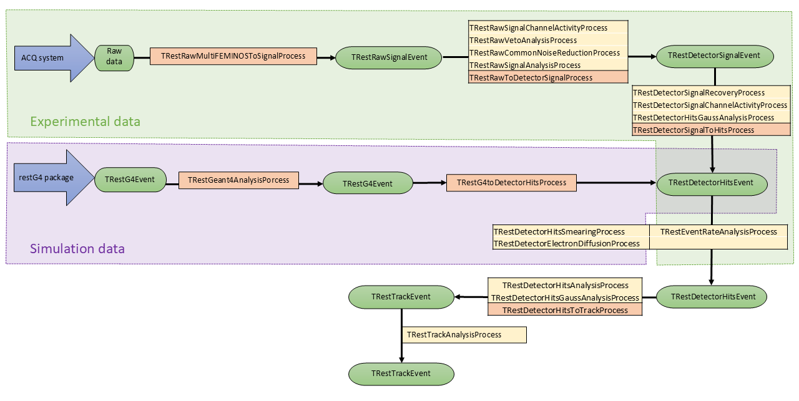
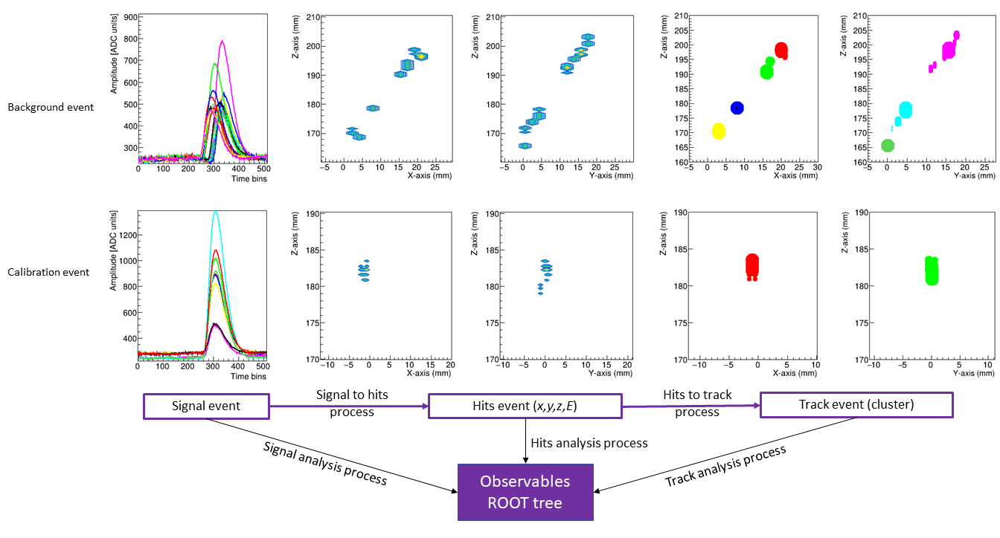
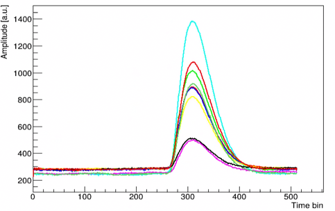
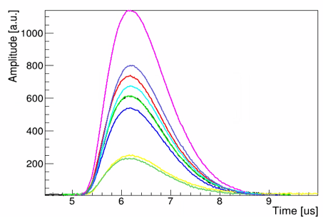
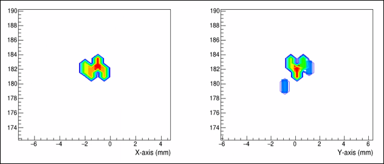
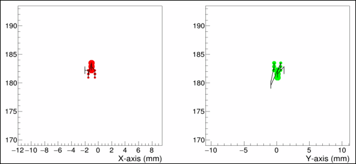

# Data Format
{: .no_toc }

### Table of contents
{: .no_toc .text-delta }

1. TOC
{:toc}

---

REST stores data in ROOT files. A REST file usually contains three kinds of
information:

- **Metadata**, describing the run, detector configuration, readout, gas,
  geometry, analysis parameters, and processing chain.
- **Event data**, stored as objects derived from
  [`TRestEvent`](https://rest-for-physics.github.io/framework/classTRestEvent.html).
- **Analysis observables**, stored in a
  [`TRestAnalysisTree`](https://rest-for-physics.github.io/framework/classTRestAnalysisTree.html)
  and used for selections, plotting, and higher-level analysis.

This page gives a first map of the event data model. It is meant as an
orientation guide for new users; for the full list of methods of each class,
use the [class reference](https://rest-for-physics.github.io/framework/).

## Event Objects

All REST event classes inherit from
[`TRestEvent`](https://rest-for-physics.github.io/framework/classTRestEvent.html).
Each event object represents one entry in the event tree, but the physical
meaning of the entry depends on the concrete event class. For example, an event
may contain raw electronics waveforms, detector-channel signals, spatial hits,
or reconstructed tracks.

The most common event representations in a detector-analysis chain are:

- [`TRestRawSignalEvent`](https://rest-for-physics.github.io/framework/classTRestRawSignalEvent.html)
- [`TRestDetectorSignalEvent`](https://rest-for-physics.github.io/framework/classTRestDetectorSignalEvent.html)
- [`TRestDetectorHitsEvent`](https://rest-for-physics.github.io/framework/classTRestDetectorHitsEvent.html)
- [`TRestTrackEvent`](https://rest-for-physics.github.io/framework/classTRestTrackEvent.html)

These classes do not replace one another arbitrarily. They represent different
levels of reconstruction.

## From Raw Signals to Tracks

For data acquired from electronics, the usual conceptual flow is:

```text
DAQ data
  -> TRestRawSignalEvent
  -> TRestDetectorSignalEvent
  -> TRestDetectorHitsEvent
  -> TRestTrackEvent
  -> analysis observables
```

For simulations, the chain often starts from generated or simulated particles
and then moves toward detector response:

```text
TRestGeant4Event
  -> TRestDetectorHitsEvent
  -> TRestDetectorSignalEvent
  -> TRestRawSignalEvent
```

The next figure shows how experimental data and simulated data enter related
REST processing chains. Experimental data usually start from raw DAQ data and
are converted into raw signal events and detector signal events. Simulations
usually start from restG4 events and enter the detector chain at the hit-event
level. From there, both paths can use common detector-hit, track, and analysis
processes.



The following figure shows a Micromegas example of this event evolution. The
same processing steps are applied to a background event and to a calibration
event: signal events are transformed into hit events, hit events can be
clustered into track events, and analysis processes write observables into a
ROOT tree.



## Raw Signal Events

[`TRestRawSignalEvent`](https://rest-for-physics.github.io/framework/classTRestRawSignalEvent.html)
stores digitized raw waveforms. It is a collection of
[`TRestRawSignal`](https://rest-for-physics.github.io/framework/classTRestRawSignal.html)
objects, where each signal normally corresponds to one electronics or readout
channel.

Each `TRestRawSignal` stores ADC-like samples indexed by time bin. This is the
representation closest to the DAQ waveform and is the natural place for
baseline correction, threshold finding, raw pulse-shape observables, and
channel-level waveform inspection.



Use this representation when the analysis depends on ADC samples, time bins,
baseline windows, thresholds, or raw waveform shape.

## Detector Signal Events

[`TRestDetectorSignalEvent`](https://rest-for-physics.github.io/framework/classTRestDetectorSignalEvent.html)
stores detector-channel signals in physical coordinates. It is a collection of
[`TRestDetectorSignal`](https://rest-for-physics.github.io/framework/classTRestDetectorSignal.html)
objects, where each signal stores time-charge points rather than a fixed
ADC-bin array.

This representation is used after raw data have been converted into detector
signals, or after simulated detector hits have been projected onto a readout.
The time axis is expressed in physical units, typically microseconds, and the
signal ID identifies the corresponding detector or readout channel.



Use this representation when the analysis needs channel signals expressed in
physical time, or when converting between readout-channel information and
spatial detector hits.

## Detector Hit Events

[`TRestDetectorHitsEvent`](https://rest-for-physics.github.io/framework/classTRestDetectorHitsEvent.html)
stores spatial hits in detector coordinates. A hit represents a localized
energy deposit or reconstructed point in the detector. Compared with signal
events, hit events no longer describe channel waveforms; they describe
positions and energies.



Use this representation for hit maps, spatial selections, fiducialization,
topology variables, and reconstruction steps that operate on positions rather
than electronics channels.

## Track Events

[`TRestTrackEvent`](https://rest-for-physics.github.io/framework/classTRestTrackEvent.html)
stores reconstructed track information. Track events are built from hits and
organize them into higher-level structures that describe event topology.



Use this representation when the analysis needs track observables, such as
cluster or topology variables, rather than individual waveform or hit-level
quantities.

## Analysis Observables

Event objects store the detailed event representation. Analysis observables are
the quantities extracted from those events and written to a
[`TRestAnalysisTree`](https://rest-for-physics.github.io/framework/classTRestAnalysisTree.html).
They are usually simpler values such as energies, integrals, amplitudes, times,
positions, number of hits, or selection flags.

In practice, most plotting and event selection is done with the analysis tree,
while event objects are used when the analysis needs to inspect or transform the
event content itself.

## Which Event Type Is in My File?

When opening a REST file, the first practical question is often: which event
class does this file contain?

In `restRoot`, a quick check is:

```cpp
TRestRun run("myFile.root");
std::cout << run.GetInputEvent()->ClassName() << std::endl;
```

Once the event type is known, retrieve it with the corresponding class:

```cpp
TRestRun run("myFile.root");
run.GetEntry(0);

auto event = run.GetInputEvent<TRestRawSignalEvent>();
event->DrawEvent();
```

Replace `TRestRawSignalEvent` with the event class stored in your file, for
example `TRestDetectorSignalEvent`, `TRestDetectorHitsEvent`, or
`TRestTrackEvent`.

## Where to Go Next

- [Quick REST file inspection](/getting-started/quick-data-inspection.html)
- [Drawing event data](/getting-started/drawing-events.html)
- [Browsing and viewing events](/getting-started/browsing-and-viewing-events.html)
- [Class reference](https://rest-for-physics.github.io/framework/)
