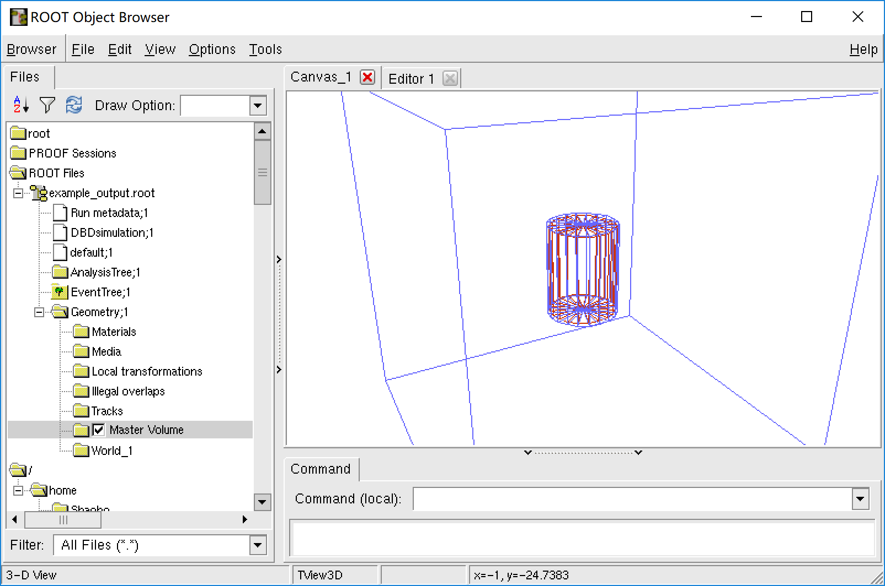

Several example rml files have been added into [restG4 example directory](https://github.com/rest-for-physics/restG4/tree/master/examples). To start 
our first geant4 simulation, we enter the following directory and run restG4:

:~$ `cd $REST_PATH/example/restG4template`

:restG4template$ `restG4 restG4.rml`

Then, a geant4 simulation will start for 100 events, generating a file "example_output.root". This root file 
contains a TTree with branch `TRestGeant4EventBranch`, and a TGeoManager named "Geometry". We can view them 
in TBrowser.

With restG4, we can do a two-step simulation to test our detector response. First use restG4 to generate 
root file with raw event data. Then use REST build-in processes to convert this root file into signal 
event(readout waveform), which is very close to the data we get from real world detector. Then we can try
our analysis algorithm upon this simulation data. 

For example, we process the previous output file with the example rml:

:restG4template$ `restManager --c ../simDataAnalysis.rml --i example_output.root --o abc.root`

This gives us information of cut efficiency of track recognition.
